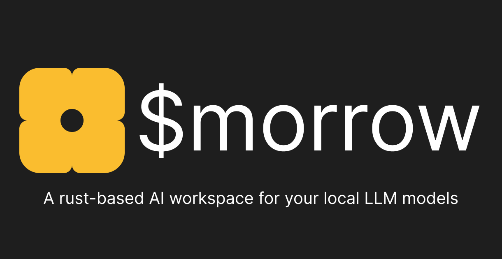

<div align="center">



<br/>

[](https://crates.io/crates/morrow)
[](./LICENSE)
[](https://github.com/utkarsh125/morrow/actions)

</div>

---

Morrow is a calm, keyboard-first terminal workspace for chatting with local language models through [Ollama](https://ollama.com) or any local OpenAI-compatible server. Every conversation lives in a local SQLite database — no accounts, no API keys, no cloud, no telemetry.

---

## Installation

```bash
# Homebrew (macOS & Linux)
brew install utkarsh125/tap/morrow

# Cargo (crates.io)
cargo install morrow

# Cargo (git)
cargo install --git https://github.com/utkarsh125/morrow

# Quick install script
curl -fsSL https://raw.githubusercontent.com/utkarsh125/morrow/main/install.sh | bash
```

## Quick Start

```bash
# 1. Start Ollama
ollama serve

# 2. Pull a model
ollama pull qwen2.5:7b

# 3. Run Morrow
morrow
```

Config is written to `~/.config/morrow/config.toml` and history to `~/.local/share/morrow/history.db` on first launch.

---

## Highlights

- **Hermes-Inspired TUI** — Status banners, collapsible sidebar (`Ctrl-B`), markdown code fences, `<think>` blocks, live token telemetry, and streaming animations.
- **65+ Kitty Themes** — Dark, Light, Retro, and Vibrant categories with a searchable browser and live RGB palette preview (`Ctrl-T` or `/theme`).
- **Slash Command Autocomplete** — Type `/` for a floating popup with instant filtering, syntax hints, and descriptions.
- **Local & Ephemeral Modes** — Persistent SQLite storage or ephemeral incognito chat (`/temp` / `/temp off`).
- **Export & Clipboard** — Copy responses to clipboard (`/copy`) or export threads to Markdown / JSON (`/export md` / `/export json`).
- **Provider Choice** — Ollama or any local OpenAI-compatible server: LM Studio, llama.cpp, LocalAI (`/provider`).
- **File Attachments** — Attach a local UTF-8 text file to any prompt with `/attach <path>`.

---

## Keyboard Shortcuts

| Key | Action |
|-----|--------|
| `Ctrl-S` / `Ctrl-Enter` | Send message |
| `Enter` | Insert newline |
| `Tab` | Autocomplete / indent |
| `Ctrl-N` | New conversation |
| `Ctrl-H` | Conversation history |
| `Ctrl-T` | Theme browser |
| `Ctrl-P` / `Ctrl-M` | Model switcher |
| `Ctrl-B` | Toggle sidebar |
| `Ctrl-Y` | Copy last response |
| `PgUp` / `PgDn` | Scroll chat |
| `Esc` | Close modal / cancel |
| `Ctrl-C` | Stop generation / quit |

---

## Slash Commands

| Command | Description |
|---------|-------------|
| `/help` | Command palette & keyboard guide |
| `/new` | New conversation session |
| `/history` | Session manager (search, preview, delete, rename) |
| `/model [name]` | Switch model or open model selector |
| `/theme [name]` | Open theme picker or switch theme |
| `/temp [on\|off]` | Toggle ephemeral chat mode |
| `/rename [title]` | Rename active conversation |
| `/delete` | Delete current conversation |
| `/system [prompt]` | View or set AI system prompt |
| `/copy` | Copy last response to clipboard |
| `/export [md\|json]` | Export conversation |
| `/retry` | Regenerate last AI response |
| `/provider [ollama\|local]` | Switch provider |
| `/attach <path>` | Attach a text file to next prompt |
| `/stats` | Session telemetry & info |
| `/bye` | Exit |

---

## Privacy

Morrow only talks to your configured local provider — Ollama at `http://localhost:11434` by default, or an OpenAI-compatible server at `http://localhost:1234/v1`. Zero telemetry. Zero cloud.

---

## License

MIT
